# Meridian System Architecture

Meridian is a trust-first AI operating system for schools. The architecture is
designed around one promise: automate school operations aggressively, but make
every automated action explainable, auditable, and reversible where possible.

This document describes the current system architecture and the target
hackathon-winning architecture direction without changing application code.

## Executive Architecture Pitch

Meridian combines a realtime school ERP, AI automation engines, privacy-first
attendance, predictive operations, and an append-only Trust Core into one
coherent platform.

Judges should see it as more than an app. It is an operating model:

- One source of truth for every school operation.
- Five AI/automation engines working from the same data core.
- Realtime dashboards for admins, teachers, students, parents, and kiosks.
- Every AI action logged with reason, confidence, actor, and output.
- Event sourcing powers Time Machine, audit history, and one-tap undo.
- Face recognition stores mathematical embeddings, not raw child images.

## Current High-Level Architecture

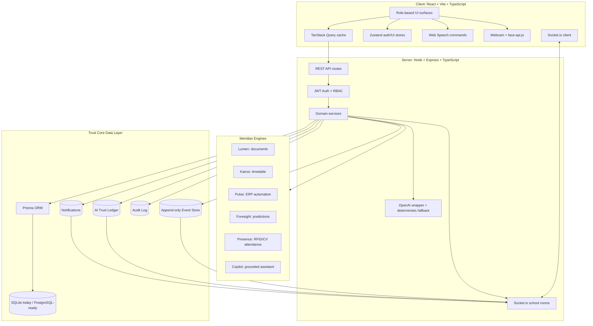

## Layered View

### 1. Experience Layer

The frontend is a Vite-powered React application. It exposes different
operational surfaces based on user role:

- Super Admin: system settings and full platform visibility.
- Principal/Admin: command center, Copilot, reports, Trust Core, staff, fees,
  Foresight, Lumen, Kairos, emergency mode, digital twin.
- Teacher: class dashboard, attendance, timetable, digital twin, emergency.
- Student/Parent: self-service dashboard, attendance, timetable, fees, updates.
- Kiosk: RFID/CV attendance and face-recognition workflows.

Core frontend responsibilities:

- Render role-specific navigation and route guards.
- Fetch and cache API data using TanStack Query.
- Invalidate stale data from realtime Socket.io events.
- Keep auth and UI state in Zustand.
- Run face detection/recognition in-browser.
- Capture voice commands and route them to attendance or Copilot.
- Present polished, judge-visible experiences with Framer Motion.

### 2. API And Orchestration Layer

The backend is an Express API with TypeScript and Prisma. It exposes REST
routes grouped by product domain:

- `/auth`
- `/dashboard`
- `/students`
- `/staff`
- `/classes`
- `/attendance`
- `/timetable`
- `/fees`
- `/documents`
- `/notifications`
- `/predictions`
- `/twin`
- `/emergency`
- `/copilot`
- `/trust`
- `/reports`
- `/face`
- `/presence` (readers, cards, scan ingest, live feed, history, analytics,
  settings, simulator)

Core backend responsibilities:

- Authenticate users through JWT bearer tokens.
- Enforce role-based access control at the API boundary.
- Scope data by school.
- Validate inputs with Zod.
- Coordinate domain services.
- Record events, AI logs, audit logs, and notifications.
- Broadcast realtime updates to the correct school room.
- Call OpenAI where configured and fall back to deterministic logic where not.

### 3. Domain Services Layer

Services contain the product intelligence:

- `eventStore`: append-only events, serialization, Time Machine inputs, undo.
- `trustLedger`: AI logs and audit logs.
- `kairos`: timetable generation, conflict explanations, what-if simulation.
- `foresight`: predictive operations with driver explanations.
- `lumen`: document extraction simulation with confidence and proof crops.
- `copilot`: grounded operational answers from live data.
- `notifications`: actionable realtime alerts.
- `face`: enrollment, vector matching, and privacy-first recognition.

### 4. Data Layer

Prisma currently targets SQLite for zero-friction local demos. The schema is
designed to be PostgreSQL-ready:

- string constants instead of native enums,
- JSON payloads stored as text,
- portable relational modeling,
- Docker Compose already includes PostgreSQL and Redis.

Core data groups:

- School tenant and identity.
- Academic structure.
- Attendance and Presence.
- Fees and payments.
- Documents and extracted fields.
- Timetables and substitution planning.
- Predictions.
- Events, AI logs, audit logs.
- Notifications and emergencies.
- Face embeddings and face events.

## Trust Core

The Trust Core is the winning differentiator. It turns AI from a black box into
an accountable operating layer.

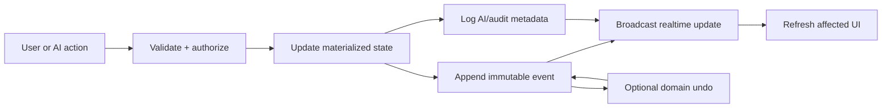

What the Trust Core gives Meridian:

- Audit Timeline: every important change has a historical trail.
- Time Machine: reconstruct operational metrics at a past timestamp.
- AI Trust Ledger: every AI action stores engine, action, reason, confidence,
  inputs, outputs, actor, and reversibility.
- Undo: selected event types have domain-specific reversal handlers.
- Judge clarity: the demo can answer "why did the system do that?"

## AI And Automation Engines

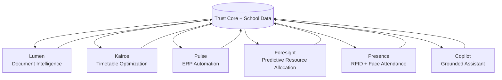

### Lumen: Document Intelligence

Purpose:

- Convert school documents into verified ERP records.
- Surface low-confidence fields for human review.
- Preserve proof crop coordinates for every extracted value.

Current architecture:

- Multer receives document uploads into memory.
- Lumen generates extracted fields from document type templates.
- Extracted fields include confidence, status, and normalized crop coordinates.
- AI log and event log are written after processing.

Winning upgrade:

- Add real OCR or multimodal extraction.
- Preserve the current proof-crop and human-review UX.
- Queue extraction jobs through Redis/BullMQ.

### Kairos: Timetable Optimization

Purpose:

- Generate feasible school timetables.
- Explain conflicts instead of silently failing.
- Simulate teacher absence ripple effects.

Current architecture:

- Custom TypeScript solver places schedule demand against hard constraints.
- Tracks class, teacher, and room/lab occupancy.
- Applies teacher hour caps and lab requirements.
- Produces soft scores and minimal conflict explanations.

Winning upgrade:

- Add OR-Tools CP-SAT as an optimization service.
- Keep TypeScript as the orchestration and explanation layer.
- Add scenario comparison and constraint sliders.

### Pulse: ERP Automation

Purpose:

- Run day-to-day school operations from a unified event-backed system.

Current architecture:

- Students, classes, staff, attendance, fees, notifications, dashboards.
- Admin, teacher, student, and parent dashboards all read the same source.
- Attendance and fee actions write immutable events.

Winning upgrade:

- Add offline-first attendance sync.
- Add background notification jobs.
- Add integrations for payment gateways and SMS/WhatsApp providers.

### Foresight: Predictive Resource Allocation

Purpose:

- Predict operational strain before it becomes a crisis.

Current architecture:

- Computes forecasts from attendance, fees, teacher loads, and class data.
- Produces absence, substitute-demand, attendance-trend, and fee-risk
  predictions.
- Stores transparent driver explanations.

Winning upgrade:

- Add richer ML features: calendar, weather, exam schedule, holidays,
  transport route issues.
- Add confidence calibration and drift monitoring.
- Create a "pre-solve tomorrow" loop with Kairos.

### Presence: Event-Driven Attendance Platform

Purpose:

- Automate attendance from any input source — RFID, manual, on-device
  face recognition — through one backend pipeline, so attendance is the
  *event* that drives the rest of the ERP, not a feature bolted onto it.

Current architecture:

```
RFID reader / Simulator / Manual mark / Face kiosk
        │  (every source normalizes to the same ScanInput)
        ▼
POST /api/presence/scan   ← the one adapter seam — a real reader device
                             authenticates here with a per-reader key
                             instead of a user JWT
        ▼
services/presence/engine.ts  processScan()
  reader exists → reader online (RFID only) → card active → card
  assigned → student active → duplicate-window check → late + direction
  policy  — all inside one prisma.$transaction:
     AttendanceEvent created (append-only raw scan log)
     Attendance upserted (existing materialized daily row — unchanged,
                           so Dashboard/Twin/Foresight/Reports need no
                           changes downstream)
     recordEvent(tx)  (Trust Core — audit/undo/Time Machine)
  → after commit: Trust Ledger entry, parent notification (in-app +
    SMS/email/push channel stubs), realtime `presence:event` broadcast
```

- `RFIDCard`/`RFIDReader`/`AttendanceEvent`/`ReaderHeartbeat` are first-class
  Prisma models. Cards have a full lifecycle (issue/replace/disable/lost/
  broken/reissue) with duplicate-UID detection; readers report heartbeats and
  are swept offline once stale.
- Unknown card UIDs never create attendance — they raise a reviewable
  security notification to admins instead.
- Duplicate scans within a configurable window are logged but never
  double-counted; late arrival is computed against a per-school configurable
  start time + grace period.
- The face-recognition kiosk and the teacher roster's manual PRESENT/LATE
  marks both call the same `processScan()` — there is exactly one place that
  writes attendance.
- A production-shaped RFID simulator (`/presence/simulator`) drives the exact
  same `processScan()` a physical reader would; switching to real hardware
  means pointing a small gateway script at the same `/presence/scan` endpoint
  with a device key, nothing else in the ERP changes.
- Face models still run in the browser using `@vladmandic/face-api`, with
  128-D embeddings only (no raw images stored) and a blink/liveness check.

Winning upgrade:

- Add pgvector/FAISS for scalable face matching.
- Wire a real SMS/email/push provider behind `services/presence/channels.ts`
  (the call sites and payloads are already in place).
- Add offline kiosk/reader queueing for network outages.

### Copilot: Grounded Operational Assistant

Purpose:

- Let principals ask natural-language questions about live operations.

Current architecture:

- Builds factual snapshots from the database.
- Uses OpenAI if configured.
- Falls back to deterministic intent routing.
- Logs answers into the AI Trust Ledger.

Winning upgrade:

- Add tool-calling actions with explicit confirmation.
- Add prompt/version logging.
- Add citations to specific events, records, and dashboards.

## Key End-To-End Flows

### Login And Role-Based Access

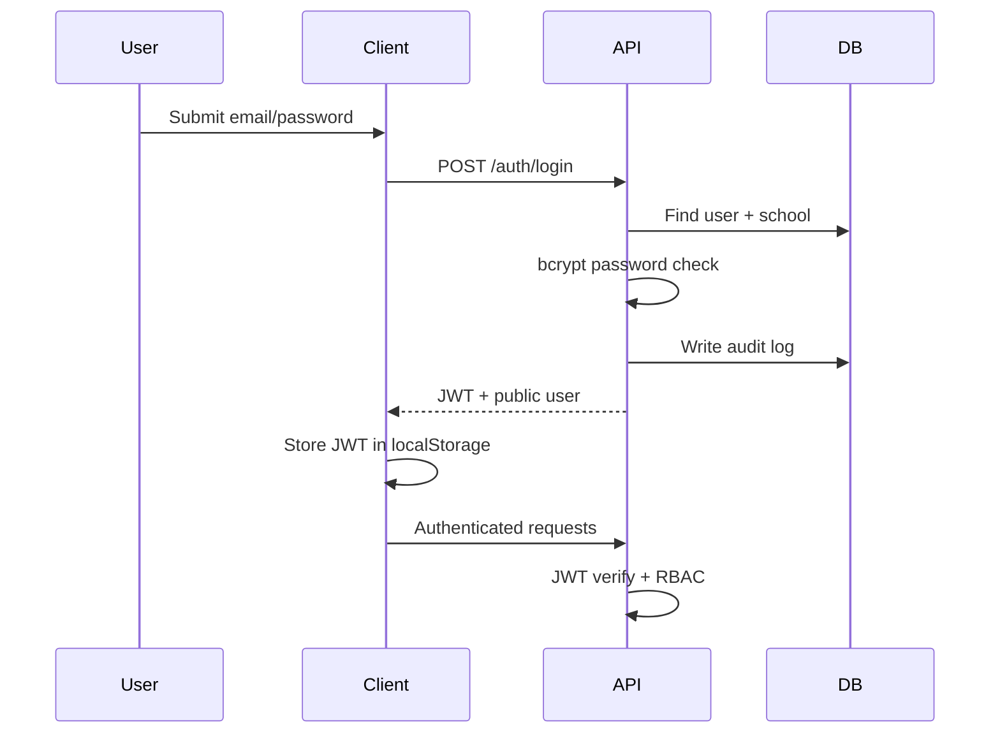

### Attendance Marking

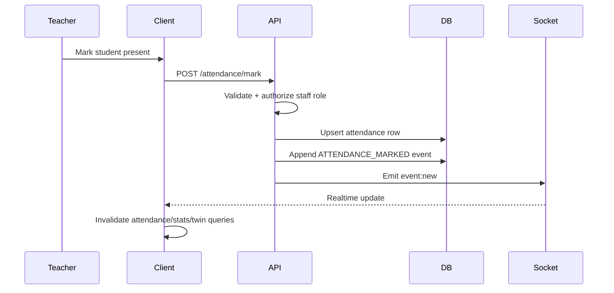

### Face Recognition Attendance

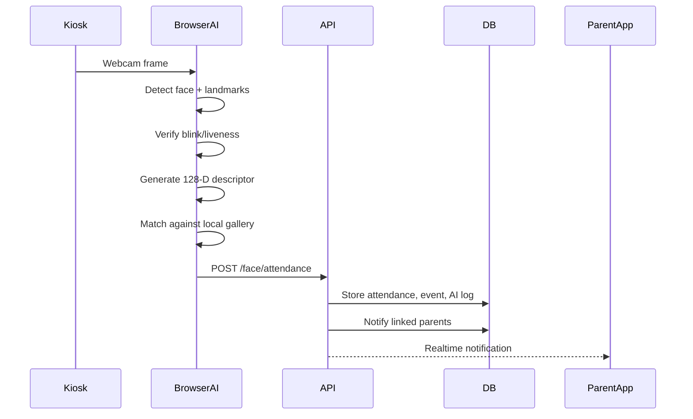

Privacy guarantee:

- Raw video frames stay in browser memory.
- Stored biometric record is a numeric vector, not an image.
- Unknown/spoof events store metadata, not photos.

### AI Copilot Answer

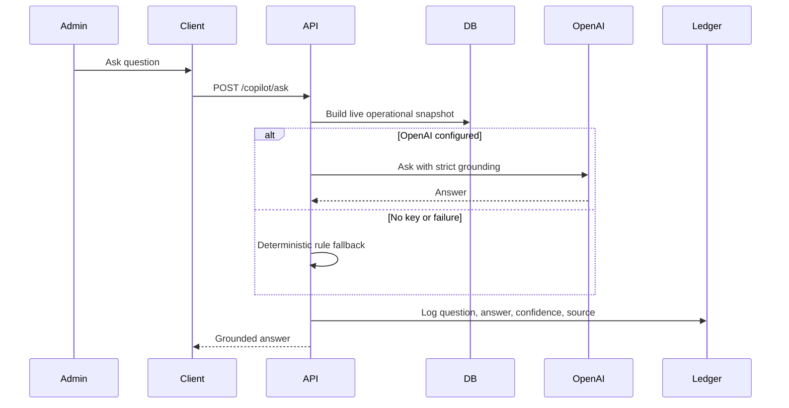

### Emergency Mode

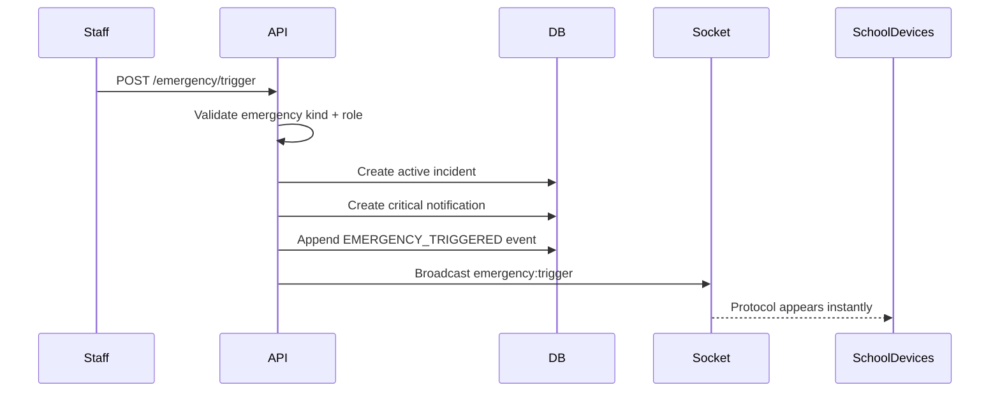

## Realtime Architecture

Realtime is not decorative. It is the nervous system that makes Meridian feel
like a live operating platform.

Current realtime events:

- `event:new`
- `ai:log`
- `notification:new`
- `presence:event` (every scan outcome — verified/late/duplicate/unknown/rejected)
- `presence:reader-status` (a reader flips online/offline)
- `emergency:trigger`
- `emergency:resolve`
- `face:unknown`
- `face:attendance`

Current behavior:

- Clients join a school-specific Socket.io room.
- Server broadcasts only to the matching school room.
- Frontend listeners show toasts and invalidate relevant React Query caches.

Scale-ready upgrade:

- Add Socket.io Redis adapter.
- Add durable event queue for reconnects.
- Add server-side fan-out metrics.

## Security Architecture

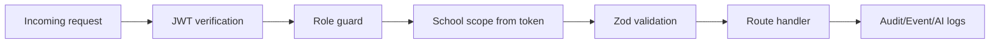

Security controls already present:

- JWT bearer authentication.
- Password hashing with bcrypt.
- API-level role authorization.
- UI-level role route guards.
- Zod input validation.
- Helmet security headers.
- CORS restricted to the configured client origin.
- API rate limiting.
- School-scoped queries.
- Audit logs for important user activity.
- Privacy-first face recognition.

Recommended hardening:

- Rotate JWT secrets through environment management.
- Add refresh tokens or short-lived access tokens.
- Add audit views for failed auth attempts.
- Add data export/delete flows for privacy compliance.
- Add signed URLs for uploaded documents.

## Deployment Architecture

### Current Local Development

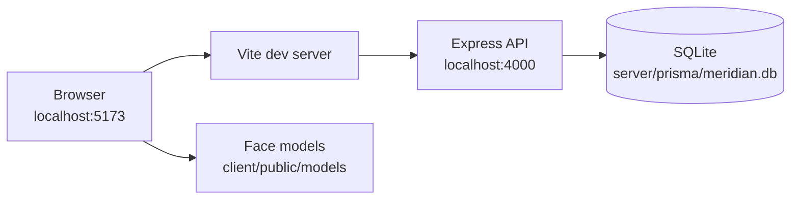

### Hackathon Demo Deployment Target

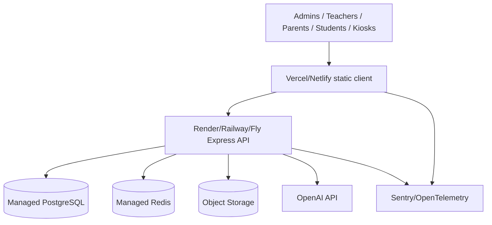

Deployment priorities:

1. Keep local SQLite for fast judge setup.
2. Use PostgreSQL for deployed demos.
3. Add Redis for jobs and Socket.io scaling.
4. Store uploaded documents in object storage.
5. Keep OpenAI optional with deterministic fallback.

## Reliability And Failure Strategy

Meridian should never die on stage. The current architecture already supports a
strong demo reliability story:

- If OpenAI is missing or fails, Copilot and reports fall back to deterministic
  logic.
- Lumen currently uses deterministic extraction, so document demos are stable.
- SQLite local mode avoids external database setup for local judging.
- Socket.io updates enhance UX, but REST queries still return source-of-truth
  data.
- Face recognition models are served locally from the app, not fetched from a
  third-party CDN at runtime.

Recommended reliability upgrades:

- Background job retries for document processing and reports.
- Offline queue for attendance kiosks.
- Health checks for API, DB, Redis, AI provider, and kiosk devices.
- Playwright smoke tests for the demo path.

## Why This Can Win A Hackathon

Most hackathon school products become dashboards or chatbots. Meridian is more
ambitious and more defensible:

- It has a real operational data model.
- It connects AI outputs to school workflows.
- It supports multiple roles, not just one admin persona.
- It has realtime feedback loops.
- It treats trust, auditability, and reversibility as core product features.
- It shows privacy thinking in attendance and biometrics.
- It has deterministic fallbacks, so the live demo is resilient.
- It has a clean path from prototype to production architecture.

## Judge Demo Storyboard

1. Principal logs in and sees Operational Health.
2. Command Center surfaces ranked alerts.
3. Lumen processes a document and highlights proof crops.
4. Kairos solves the timetable and explains conflicts.
5. Foresight predicts tomorrow's absence/substitute demand.
6. Presence marks a student through RFID or face recognition.
7. Parent receives realtime attendance notification.
8. Copilot answers a live operational question from real data.
9. Emergency Mode broadcasts a protocol instantly.
10. Trust Core rewinds history and undoes a reversible event.

The story is simple: Meridian automates the school, and the school can still
trust every action.

## Target Architecture Roadmap

### Immediate Hackathon Polish

- Add `system-architecture.md` and `techstack.md` to explain the build clearly.
- Add demo-safe environment templates.
- Add one-click seed/reset script for judges.
- Add Playwright smoke test for the demo route.

### Near-Term Technical Upgrades

- PostgreSQL + Prisma migrations.
- Redis + BullMQ job queue.
- Real OCR/vision extraction for Lumen.
- Object storage for uploaded documents.
- OR-Tools optimization service for Kairos.
- pgvector/FAISS for scalable vector matching.

### Production-Grade Upgrades

- OpenTelemetry and Sentry.
- Socket.io Redis adapter.
- Service worker and offline attendance queue.
- Fine-grained permissions.
- Data retention and privacy workflows.
- Multi-school deployment isolation.

## Architecture Principles

- Trust first: AI must explain itself.
- Human in the loop: low-confidence automation goes to review.
- Reversible by design: undo is part of the product, not an afterthought.
- Realtime by default: operational changes should appear instantly.
- Privacy by architecture: avoid storing sensitive raw data when vectors or
  metadata are enough.
- Demo resilient: no critical path should depend on a single external service.
- Production portable: local SQLite, deployed PostgreSQL, same Prisma model.

## One-Line Architecture Pitch

Meridian is a realtime, event-sourced, AI-assisted school operating system
where React, Express, Prisma, Socket.io, OpenAI, and on-device face recognition
work through a Trust Core that makes every automated action explainable,
auditable, and reversible.
